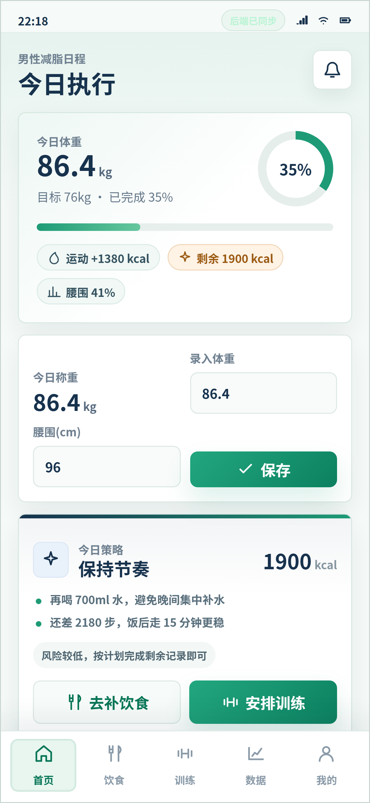
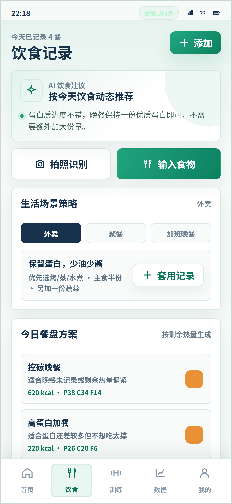

# 稳减男性减脂 App 原型

这是一个主要适配安卓手机尺寸的男性减脂与健康管理 App 原型，包含首页、饮食、训练、数据、我的五个底部导航页面。项目使用原生前端 + Node 静态服务，无需数据库，内置模拟数据和本地营养估算接口。

## 界面预览





## 核心功能

- 首页：体重、腰围、热量预算、今日策略、任务和习惯补记
- 饮食：餐次记录、AI 营养估算、蛋白质进度、餐盘建议和场景策略
- 训练：今日推荐训练、自定义运动记录、预估消耗和训练打卡
- 数据：体重趋势、热量赤字、运动消耗、任务完成率和周复盘
- 我的：基础信息、BMI、基础代谢、推荐热量、目标设置和徽章

## 本地运行

```powershell
npm run dev
```

访问 `http://localhost:5173`。

默认访问密码是 `fit2026`。公网演示前建议换成你自己的密码：

```powershell
$env:APP_ACCESS_PASSWORD="your-strong-password"
npm run dev
```

## 后端接口

- `GET /api/health`：服务健康检查
- `POST /api/session`：使用访问密码换取临时访问 token
- `GET /api/state`：读取用户当前 App 状态和餐次数据
- `PUT /api/state`：保存用户当前 App 状态和餐次数据
- `DELETE /api/state`：清空后端保存的数据
- `POST /api/ai/nutrition`：根据食物内容、总量、单位、做法、用油和酱料免费估算热量、蛋白质、碳水、脂肪

数据会持久化到 `data/app-state.json`，前端会优先同步后端，网络失败时使用浏览器本地存储兜底。
