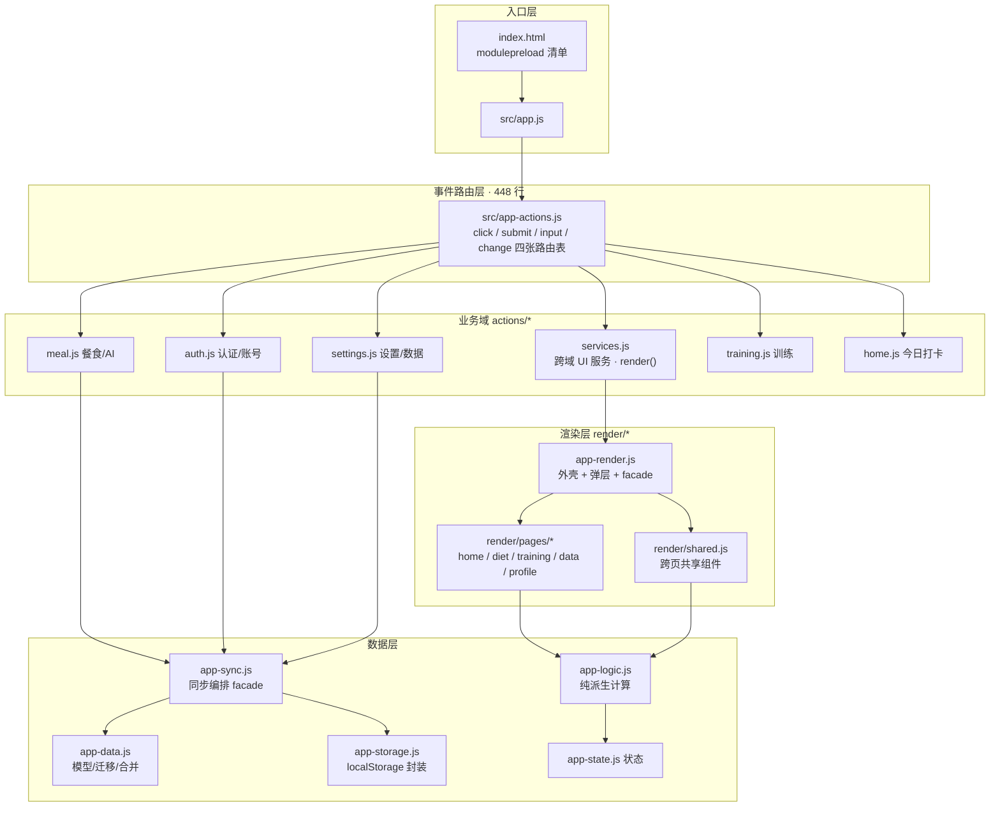
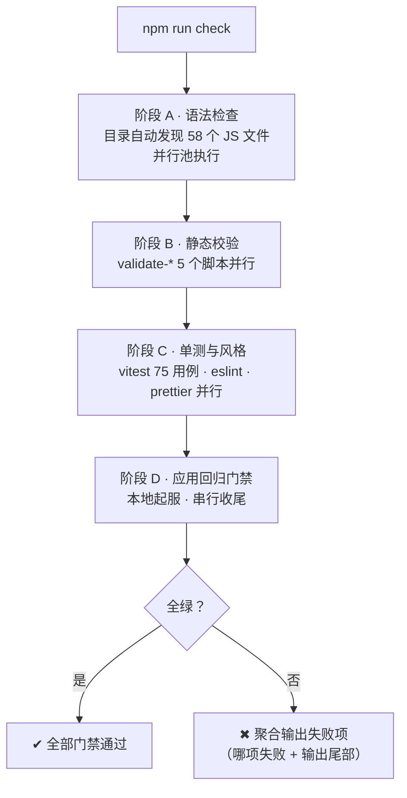

# 五批架构优化与工程化改造总结报告

> **项目**：稳减 · 私人健康手账（PWA）｜**周期**：2026-08 · 五批连续推进 + 复审修正轮｜**方法**：审阅先行 · 门禁先行 · 批次验证｜**状态**：五批收官 · 复审退回项已全部修正

稳减 · 私人健康手账（PWA）—— 从安全加固到架构拆分再到工具链建设的完整改造复盘：约 20 个子项、14 个新模块；随后经独立复审退回，修正 1 项 P0、5 项 P1、3 项 P2 与多处报告口径问题；最终形成 130 项自动化检查。

## 核心成效速览

| 指标 | 数值 | 说明 |
|------|------|------|
| 改造批次 | **5 批 + 复审修正** | 20 个优化子项 + 复审退回 9 项全部闭环 |
| app-actions.js 行数 | **1892 → 448** | 收敛 76%，入口层 + 域模块 |
| 拆分产出 | **14 个模块** | 最大模块仅 603 行 |
| 自动化检查 | **130 项** | 75 单测 + 44 非视觉 E2E + 11 视觉基线 |
| ESLint 存量错误 | **131 → 0** | 并完成 52 文件全量格式化 |
| 版本发布 | **1 条命令** | 从 5 处手动同步改为脚本一键 |

---

## 01 概述与方法论

本轮改造起于一次全面代码审阅：项目基础质量高于同类原型（HttpOnly Cookie 刷新、RLS 用户隔离、离线按天合并、原子文件写入），但在**安全细节、服务端性能、渲染开销、巨型文件与工具链**五个维度存在系统性优化空间。审阅产出方案文档后，按风险与收益排序分五批实施。

**推进方法论：**

- **先出方案，不动代码**——全部结论先在源码中逐条核实，形成带优先级的实施清单，经确认后才动工。
- **安全优先**——P0 安全项（第一批）先于性能（第二批）、渲染（第三批）落地；**重构前先补测试**，动渲染与拆分前先完成 vitest 64 用例单测覆盖，给重构上保险。
- **批次验证**——每一批结束时跑全量门禁（语法 / 校验 / 单测 / 回归）与 E2E（含视觉基线），全绿后才进入下一批；任何批次都不携带已知缺陷前进。
- **门禁固化**——每类修复都沉淀为可回归的自动检查（转义门禁、CSP 断言、版本同步校验等），防止同类问题回潮。

---

## 02 总体成效

| 批次 | 定位 | 核心产出 | 子项 |
|------|------|----------|:----:|
| 第一批 | 安全加固（P0） | 属性转义统一 + 门禁、HSTS、CSP 移除 unsafe-inline、限流有界清理、scrypt 提参 | 5 |
| 第二批 | 性能优化 | 静态服务异步 IO、Brotli 压缩、modulepreload 预加载 | 3 |
| 第三批 | 渲染局部化 | 按页短路局部渲染 + 页面基线比对跳过无关重建 + 焦点/光标恢复 | 1 |
| 第四批 | 架构拆分 | 渲染层解耦、四张事件路由表、render 按页拆分、actions 按域拆分、重复收敛、sync 三分 | 6 |
| 第五批 | 工程化 | ESLint + Prettier、CI 并行 + 浏览器缓存、版本一键发布、check 收敛、文档口径统一 | 5 |
| 复审修正轮 | 评审退回修正 | 并发写数据丢失（P0）、HTTP/限流/注销边界（P1×5）、Brotli 与 CI 与脚本确定性（P2×3） | 9 |

五批推进过程中定位并修复 **7 类真实缺陷**（XSS 属性插值未转义、同步 IO 事件循环阻塞、两处测试时序竞态、路由表首参误传、未用导入与冗余转义）；复审修正轮又以外部评审为镜，闭环 1 项 P0（并发同步静默丢数据）与 8 项工程缺陷。最终验证：门禁六阶段全绿，E2E **55/55 通过**（含 11 项视觉断言），vitest **75/75**。

---

## 03 第一批 · 安全加固（P0）

### 1.1 属性转义统一 + 门禁（消除 XSS 面）

审阅发现 `app-render.js` 存在 **51 处文本节点转义，但 `data-*`、`value`、`placeholder` 属性插值未转义**的治理漏洞，叠加 `root.innerHTML` 注入构成 XSS 攻击面。本批将全部属性插值统一转义，并在回归门禁中新增 `checkAttributeEscapingGate`——状态机扫描标记产出文件的未转义属性插值，第四批拆分出的全部渲染模块同步纳入扫描范围。

### 1.2 HSTS

仅当请求经 `x-forwarded-proto: https` 判定为安全链路时返回 `max-age=63072000; includeSubDomains`；**明文 HTTP 响应不带 HSTS**（避免本地调试与反代前的固化风险），两条行为均有门禁断言。

### 1.3 CSP 移除 unsafe-inline（动态样式水合）

7 处内联 `style="…"` 改为**转义后的 `data-*` 属性 + `hydrateDynamicStyles()` CSSOM 水合**：渲染后把值写入 CSS 自定义属性，规则侧以 `calc(var(--x, 0) * 1%)` 取值。CSP `style-src` 随之移除 `'unsafe-inline'`，门禁新增内联样式禁令、水合接线、CSP 头三条断言。

### 1.4 限流标注与有界清理

进程内存限流按**单实例部署**设计，该假设显式标注于 render.yaml 与 README（多实例需先迁 Redis/DB）。超限清理从全表遍历改为**每请求最多 64 个最旧桶的有界惰性扫描**，高峰期不再叠加整表扫描的 CPU 尖刺。（该设计在复审修正轮进一步加固：限流键改用平台覆盖的 `CF-Connecting-IP`，并补齐每桶独立窗口与容量硬顶，见 08 节。）

### 1.5 scrypt 显式提参

密码哈希从 Node 默认参数升级为 **N=2^15 / r=8 / p=1 + 显式 maxmem 64MB**（128·N·r 恰在 Node 32MB 默认上限），实测中位 **81ms**。新记录存储 cost 块，老记录按存储参数回验并做范围守卫，平滑迁移无感。

---

## 04 第二批 · 性能优化

### 2.2 静态服务异步 IO

`statSync`/`existsSync` 全部替换为 `fs.promises.stat`，消除高并发下的**事件循环阻塞**——单请求的同步文件操作在并发下会串行化整个进程。

### 2.3 Brotli 压缩

`Accept-Encoding` 含 `br` 时**优先于 gzip**（quality 5），仅压缩 >1KB 的可压缩类型；ETag 增加 `-br`/`-gzip` 变体后缀，避免编码变体间缓存串味。（复审发现本批遗留两处缺陷并已在修正轮修复：顶层 `quality` 选项实际被 Brotli 静默忽略、`q=0` 编码被错误接受，见 08 节。）

### 2.4 modulepreload 消除加载瀑布

应用为无 bundle 的渐进式 ES Module（15+ 模块串行发现），移动网络首屏多轮往返。`index.html` 增加全量 `modulepreload` 清单；门禁校验清单与 `src/*.js` 模块集合**精确一致**——入口 URL 与 script 标签逐字符匹配、依赖模块用无版本 URL。该约束在第四批拆分时经受了实战检验（新模块全部登记）。

---

## 05 第三批 · 渲染局部化

渲染层原为全量 `root.innerHTML = appShell()`。本批分两步收敛为**分步局部渲染**（keyed diff 第三步经评估刻意不采用）：

**第一步 · 按页短路**：`render()` 先比对 `shellSignature()` 与 `runtime.lastShellSignature`——同标签页、无弹层的数据变化走 `patchCurrentPage()` 只重建**当前页容器**；结构性变化（切页 / 弹层 / 认证分支）仍走全量渲染。

**第二步 · 基线比对 + 焦点恢复**：补丁内部比对 `runtime.lastPageHtml`——页面 HTML 未变（典型如 toast 显示/清除、aria 公告）时**跳过页面重建**；确实重建时先抓取正在输入的控件（`name`/`id`/`data-*` 选择器 + 选区），重建后恢复焦点与光标，草稿值由状态同步天然保留。两条路径均有 E2E 用例覆盖。

> **前置保险**：动渲染前先完成 4.1——vitest 覆盖 `app-logic` 与 `app-sync` 的 64 个单测（热量口径、进度计算、迁移链、按天合并边界），并接入 check 链。这是「重构上保险」方法论的直接落地。

---

## 06 第四批 · 架构拆分

本批是体量最大的一批：三个巨型文件（app-actions.js 1892 行、app-render.js、app-sync.js）按关注点拆分为 **14 个职责单一的模块**，导出面保持兼容（app.js、测试与门禁零改动）。

### 拆分后的模块架构

### 3.2a · 事件路由表替代 if-else 链

`handleAppClick` 的 250 行 if-else 链转为 **42 项声明式 `clickRoutes`**（按声明顺序匹配，保持原分支优先级），submit/input/change 同样表化。新增交互只需在对应表加一行。表化同时消除了旧代码 16 处「函数定义与分支内联体重复」的残留——13 个成为路由处理器，3 个一行守卫包装直接内联删除。

### 3.2b / 3.2c · render 与 actions 按域拆分

- **渲染层**：拆为 `render/shared.js`（页头 / 同步状态 / 餐卡 / 图表等共享组件）+ `render/pages/` 五页模块；`app-render.js` 收敛为外壳 + 弹层 + facade 再导出。
- **动作层**：拆为 `actions/services.js`（`render()`、toast、页签路由、焦点/弹层管理、图表交互、`readFormValues()` 等跨域服务——`render()` 落位于此以避免循环依赖）+ meal / auth / settings / training / home 五个业务域。
- **事件绑定**：从「每次 render 重试」改为 `initApp()` 首行一次性挂载（挂载点 #app/document/window 均为持久节点），行为等价。

### 模块行数分布（2026-08-29 源码实测）

| 模块 | 行数 | 模块 | 行数 |
|------|-----:|------|-----:|
| app-actions（**拆分前·单体**） | 1892 | render/shared · 共享组件 | 244 |
| app-logic · 派生计算 | 603 | render/pages/home | 233 |
| app-render · 外壳+facade | 467 | render/pages/diet | 210 |
| app-data · 数据模型 | 362 | app-storage · localStorage | 135 |
| actions/meal · 餐食/AI | 346 | app-utils · 工具 | 94 |
| app-sync · 同步编排 | 327 | actions/training · 训练 | 90 |
| app-state · 状态 | 326 | render/pages/training | 86 |
| actions/services · 跨域UI服务 | 309 | render/pages/data | 85 |
| actions/auth · 认证/账号 | 289 | actions/home · 今日打卡 | 71 |
| actions/settings · 设置/数据 | 246 | render/pages/profile | 63 |

### 3.1 / 3.3 / 3.4 · 解耦、收敛与 sync 三分

- **3.1 解耦**：`backendStatusText` 移入 app-logic.js，渲染层只消费 state；`readStorageValue` 调用点收敛到 actions 与初始化层。
- **3.3 重复收敛**：`clearMealDraftAI()` 统一草稿变更时的 AI 状态清理；`readFormValues()` 供 meal/settings 两处表单共用；指标字段以 `data-setting-*` 配置化，Onboarding 复用同一表单与校验。
- **3.4 sync 三分**：app-data.js（数据模型 / normalize / 迁移 / 合并）+ app-storage.js（localStorage 封装）+ app-sync.js（同步编排），迁移与合并已有显式单测。

> **拆分的隐性成本——清单同步**：每个新模块需在四处登记（index.html modulepreload、sw.js APP_SHELL + 缓存代号、package.json check、回归门禁 frontendFiles）。这一认知负担直接催生了第五批的自动化（语法检查目录自动发现）。期间 e2e 还抓到一个真实缺陷：路由表直接引用带默认参的 `cancelMealNutrition` 时，匹配元素作为首参传入覆盖了默认 message——修正为显式无参调用。

---

## 07 第五批 · 工程化

### 4.2 · ESLint + Prettier

引入 ESLint flat config：**src/sw 声明浏览器 + ServiceWorker globals、server/scripts 声明 Node、tests 两者兼有**（`page.evaluate` 回调实际在浏览器执行）。存量 131 个错误清零——3 处真实未用导入删除、1 处冗余正则转义修复、`ignoreRestSiblings` 豁免 app-data.js 的解构剔除模式；随后 52 个文件全量 Prettier 格式化（printWidth 140），视觉基线确认零行为影响。

### 4.5 · check 命令收敛（run-gates.mjs）

check 从 18 个命令的单行拼接，收敛为 `scripts/run-gates.mjs` 单入口四阶段调度：

**语法检查改为目录自动发现**——新增文件零登记，直接解决第四批踩过的「忘登记 check」痛点；同时新增 `npm run lint` / `npm run format` 独立入口。

### 4.4 · 版本发布单一来源

应用壳版本戳原有 **5 处手动同步**（index.html 三处 `?v=`、sw.js 两处 `?v=` 与 `CACHE_NAME`）。`npm run bump:version` 一键完成：默认生成 `YYYYMMDD-N`（本地时区、同日递增）或 `--shell` 指定，写后自动跑 validate-version-sync 自校验。发布动作从「改五处 + 祈祷」变为一条命令；实测 20260822-1 → 20260828-1、缓存代号 v13 → v14。

### 4.3 · CI 并行与缓存

CI 从单 job 串行拆为**双并行 job**：node-check（全部确定性门禁，无需浏览器）与 playwright（E2E + 视觉回归）；Playwright 浏览器按 `package-lock.json` 哈希缓存到 `~/.cache/ms-playwright`（前缀 restore-keys 兜底），依赖不变时跳过下载，失败自动上传测试工件（复审修正轮同步修正了工件路径——上传 Playwright 实际输出目录 `output/playwright/test-results/` 与 HTML 报告，原路径 `test-results/` 与配置的 outputDir 不符，永远为空）。

**口径说明**：「PR 反馈时间约减半」是双 job 并行的结构性预期收益，尚无实测数据——该工作流在撰写本报告时仍未推送至远端，没有任何一次 workflow run。待 CI 首跑后以真实数据回填。

### 4.6 · 文档口径统一

docs/ 下六份历史文档（测试数量口径 15/17/53 混用）顶部统一加「历史快照」标注，指向 README 与优化方案文档为权威口径；README 同步更新可用命令、发布与缓存、持续集成三节。

---

## 08 复审修正轮（2026-08-29 评审退回）

五批收官后，一次独立复审以「可复现问题」为标准逐条核验源码，结论为**退回修正**：发现 1 项 P0、5 项 P1、3 项 P2，以及总结报告本身的四处口径失实。本轮按「并发数据安全 → HTTP/限流/注销边界 → 恢复全量门禁 → 修正 Brotli 与 CI → 重写验证报告」的优先顺序全部闭环。

### 8.1 · P0：并发同步静默丢失健康记录（乐观并发控制）

**缺陷**：`app-sync.js`、`supabase.mjs`、`local-auth.mjs` 三处均以整包覆盖方式保存状态，没有版本号/CAS。两个同账号会话分别写入 8 月 28、29 日记录时，后写入者整体覆盖前者，最终只剩一天——「按天合并」只发生在加载阶段，救不了并发写。

**修正**：引入嵌入式版本号 `syncRevision`，无需数据库迁移（存于 state JSON 内）：

- **服务端**：写入载荷可携带 `revision`（客户端所基于的版本）；不匹配则以 409 `STATE_CONFLICT` 拒绝并回传服务端当前载荷。Supabase 侧最终写入是**单条带版本条件的 PATCH**（`state->>syncRevision=eq.N` 进 WHERE 子句，存量无版本行以 `is.null` 兜底），读-检-写在行级原子；本机账号侧在 `mutateStore` 的写队列内完成同样的检查-写入。无版本号的旧客户端保持无条件覆盖语义，平滑兼容。
- **客户端**：PUT 收到 409 时读取 `conflict` 载荷，按既有按天合并规则（`mergePayloads`）把本地与服务端合并，采用服务端 revision 后**自动重试一次**；PUT 成功后采纳服务端返回的新 revision，避免下一次保存吃无谓的 409。
- **测试**：新增 vitest 7 用例（`server-state-conflict.spec.mjs`：版本解析、匹配写入递增、过期写入 409 且不落盘、冲突载荷完整性、旧客户端兼容）；回归门禁新增端到端冲突契约断言；Playwright 新增「409 冲突按天合并重试」用例——这正是「两个会话各写一天、后写者静默覆盖前写者」事故的直接回归门禁。

### 8.2 · P1：HTTP / 限流 / 注销边界（4 项）

- **恶意 request-target 崩溃进程**：`server.mjs` 的 `new URL()` 位于 try 外，原始请求 `GET http://[ HTTP/1.1` 即以 `TypeError: Invalid URL` 使进程 exit 1。修正为解析移入异常边界、非法目标返回 400 `REQUEST_TARGET_INVALID`；回归门禁新增**raw-socket 测试**（fetch 无法发出非法请求行）断言 400 响应且进程存活。
- **JSON 分块处理破坏中文且字节限制失真**：`api.mjs` 原以 `body += chunk` 逐块解码，UTF-8 多字节字符跨分块时被替换为 U+FFFD；1MB 上限计的是 UTF-16 字符数而非网络字节数。修正为 Buffer 累计 + 字节数计数 + 末尾统一解码；新增 4 个 vitest 用例（跨块汉字、按字节 413、40 万汉字的「字符达标字节超限」、空体）。
- **认证限流可被伪造头绕过**：原无条件采信 `X-Forwarded-For` 最左值——该值由调用方控制，每请求换一个伪造 XFF 即可让 21 次窗口限制全部失效。修正为采信 `CF-Connecting-IP`（Render 边缘 Cloudflare 对每个公共请求写入并**覆盖**调用方值，不可伪造），本机/直连流量回退 socket 地址；同时补齐**每桶独立窗口**（1 分钟与 24 小时策略不再共用同一 cutoff 清理）与**容量硬顶**（扫描后仍超限时淘汰最早插入的桶，杜绝全活跃桶下的无界增长）。依据：Render 官方文档说明 XFF 只被追加、最左值可被调用方控制，推荐 CF-Connecting-IP。
- **云端注销先删数据后删账号**：原实现先删 `app_states` 再调 Admin API 删 Auth 用户，后一步失败时账号仍在而健康记录已不可恢复。修正为**只删 Auth 用户**，数据行由迁移中既有的 `ON DELETE CASCADE` 原子清除——失败时账号与数据都完好。

### 8.3 · P1：恢复全量门禁

`run-gates.mjs` 扫描全仓，但 ESLint 与 Prettier 的忽略清单没有覆盖 `optimization-summary-report/`（含 echarts/mermaid 压缩包等生成产物），实跑 ESLint 2030 错误、Prettier 5 文件失败、`npm run check` 退出 1。修正为将报告目录与 `docs/`、`supabase/` 同类处理加入两份忽略清单；全量门禁恢复六阶段全绿（58 语法文件 / 5 校验 / vitest 75 / eslint / prettier / 回归门禁）。

### 8.4 · P2：Brotli 与 CI（3 项）

- **Brotli quality 5 实际未生效**：Node 的 Brotli 选项走 `params[BROTLI_PARAM_QUALITY]`，顶层 `quality` 是 deflate 系选项、被静默忽略（回落 quality 11 默认档；本机实测同一 CSS 32.6ms/次 vs 正确 quality 5 的 0.9ms/次，约 30 倍差距）。已修正。
- **Accept-Encoding 协商违反协议**：`br;q=0, gzip;q=1` 被错误协商为 Brotli——q=0 表示明确不可接受。重写为带 q 值解析的协商（q=0 过滤、高 q 优先、同 q 时服务端偏好 Brotli）。
- **CI 失败工件永不上传**：工作流上传根目录 `test-results/`，而 Playwright 配置的 outputDir 是 `output/playwright/test-results/`；且只配置 line reporter，并不存在所谓 HTML 报告。修正为上传实际输出目录，并为 Playwright 补配 HTML reporter。

### 8.5 · P2：工程脚本确定性（2 项）

- **run-gates 并行结果错位**：`runPool` 按完成顺序收集结果，调用方却按原始下标关联文件名，失败时可能报错文件。修正为按下标占位的索引对齐结果。
- **bump-version NaN**：默认版本号假定同日后缀是数字，但校验放行字母后缀——`--shell 20260829-beta` 之后的默认发布会生成并接受 `20260829-NaN`。修正为仅纯数字后缀才递增，其余从 1 重启。

### 8.6 · 报告口径修正（本报告同步重写）

复审同时指出总结报告四处失实并已修正：① 测试构成更正——复审时点真实构成为「64 单测 + 43 非视觉 E2E + 11 视觉 = 118 项」（原误记 64+45+9；视觉实为 9 个 390px 场景 + 320px 首页 + 430px 饮食共 11 项截图断言），修正轮再新增 11 个单测与 1 个 409 冲突 E2E，最终为「75 单测 + 44 非视觉 E2E + 11 视觉 = 130 项」；② 删除「DOM 全等证明」——`root.innerHTML === appShell()` 在 CSSOM 水合后本来就不相等，仓库也不存在该断言，渲染重构的实际验证手段是节点保留/焦点恢复断言加视觉基线（1% 像素容差）；③ 「CI 反馈时间约减半」改为结构性预期并注明尚无 workflow run 实证；④ 「全程维持 118 项」更正为「最终形成 130 项」——测试随批次递增，早期批次并不存在后来加入的 vitest 套件。

---

## 09 质量保障与验证

五批推进期间由 **118 项自动化检查**守护（每批结束全量验证后才前进）；复审修正轮为 P0/P1 修复新增 11 个单测与 1 个 409 冲突 E2E，**最终形成 130 项**：

| 验证层 | 内容 | 规模 | 结果 |
|--------|------|------|------|
| 语法检查 | node --check，目录自动发现 | 58 文件 | ✅ 全绿 |
| 静态校验 | 数据模型 / 认证就绪 / 本机账号 / AI 契约 / 版本同步 | 5 脚本 | ✅ 全绿 |
| 单元测试 | vitest：热量口径、进度、迁移链、按天合并、并发冲突、JSON 分块 | 75 用例 | ✅ 75/75 |
| 风格门禁 | ESLint（flat config）+ Prettier | 全仓 | ✅ 0 错误 |
| 回归门禁 | 本地起服：安全头 / 缓存 / 转义 / CSP / 渲染 / raw-socket | 内含多项 | ✅ 通过 |
| E2E | Playwright：DOM / 认证 / 离线同步 / PWA / 竞态 / 409 合并 | 44 用例 | ✅ 44/44 |
| 视觉基线 | 11 场景像素级对比（9 个 390px 场景 + 320px / 430px 首屏） | 11 基线 | ✅ 全部一致 |

**自动化检查构成**：vitest 单元测试 75 项 · Playwright E2E 功能 44 项 · 视觉回归基线 11 项，合计 **130 项**。

> **渲染重构的等价验证方式**：行为等价靠**节点保留 / 焦点恢复断言**（局部渲染不重建未变化页面、不打断正在输入的表单），外观等价靠**视觉基线兜底**（1% 像素容差）。不采用「`root.innerHTML === appShell()` DOM 全等」这类断言——CSSOM 动态样式水合发生在渲染之后，该等式在运行期本来就不成立。

---

## 09 经验沉淀

五批改造中沉淀的方法论与教训（已固化至项目记忆，指导后续维护）：

1. **重构前先补测试**——第四批动渲染/拆分前先做 4.1 vitest 覆盖，64 个单测是 1892 行拆分的底气；每一步都能回退。
2. **渲染重构的等价证明要靠「断言 + 视觉基线」组合**——节点保留/焦点恢复断言锁定行为，视觉基线（1% 像素容差）兜底外观；「DOM 全等」这类强断言在 CSSOM 水合架构下运行期本就不成立，不应写进验证口径。
3. **路由表函数引用需审计首参语义**——表项以 `run(control, event)` 调用，直接引用带默认参的函数会被元素覆盖首参（`cancelMealNutrition` 事故）；每个直接引用都需检查首参语义。
4. **CSP 无 unsafe-inline 时的动态样式必须走 data-* + CSSOM 水合**——这是唯一的合规通道，值回读走 `element.style.getPropertyValue("--x")`。
5. **scrypt 高成本参数需显式 maxmem**——N=32768 时 128·N·r 恰在 Node 32MB 默认限制上，必须显式 ≥64MB。
6. **视觉测试覆盖新弹层场景需固定入场动画**——入场动画与 `toHaveScreenshot` 存在竞态（settings 用例的预先存在 flaky），新场景按同样方式钉死动画。
7. **清单同步是拆分的隐性税**——四处登记的成本应尽早自动化（第五批已把语法检查改为自动发现），而非依赖人的记性。

---

## 10 展望

优化方案五批至此**全部收官**：安全面收敛（转义/CSP/HSTS/scrypt/限流均有门禁兜底）、性能面落地（异步 IO/Brotli/预加载/局部渲染）、架构面清爽（14 模块最大 603 行、路由表化、关注点分离）、工具链完备（lint/format/一键发版/并行 CI/自动发现门禁）。

后续可选增强（均非必需，按需启动）：

- **覆盖率统计**——vitest 接入 coverage 报告，量化单测盲区；
- **门禁规则迁移**——回归脚本中的源码模式检查（禁 `style=` 等）逐步迁为 ESLint 自定义规则，收敛两套检查体系；
- **CI 缓存预热**——main 分支定期预热 Playwright 浏览器缓存，避免冷缓存 PR；
- **bundle 收益复评**——模块化完成后，esbuild 轻量打包的收益-复杂度比可重新评估。

---

**一句话总结**：以「审阅先行、门禁先行、批次验证」的方法论，用五批改造把项目从「功能正确的单体原型」推进到「安全有门禁、性能有度量、架构有分层、工程有工具链」的可长期维护状态——最终 130 项自动化检查（含 11 项视觉基线）验证了每一步的行为等价，外部复审退回项全部闭环。

---

## 参考资料

1. 项目优化方案（2026-08-25 审阅结论），五批实施进度与各子项状态标注——本报告主要事实来源。`docs/optimization-review-20260825.md`（项目内文档）
2. README · 稳减私人健康手账——命令口径、发布与缓存、持续集成章节（第五批后更新）。`README.md`（项目内文档）
3. 源码工作树实测数据——模块行数（本文所有行数均为改造后实测）、测试文件清单、门禁阶段输出。`src/` · `tests/` · `scripts/run-gates.mjs`（项目内源码）
